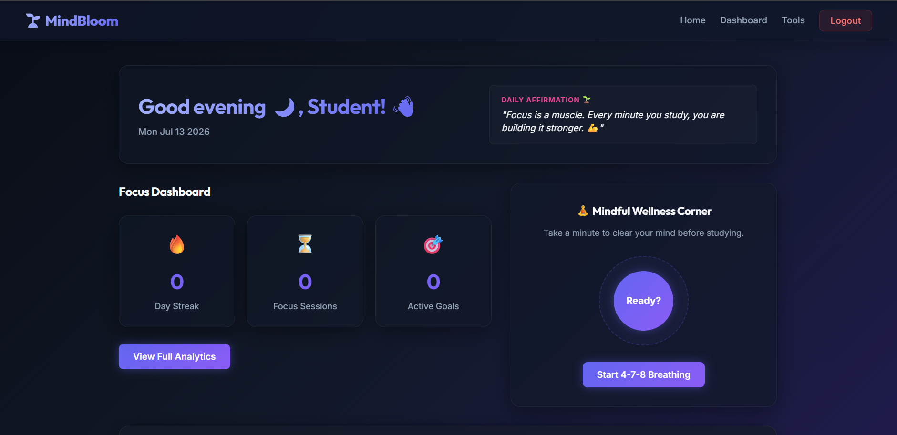
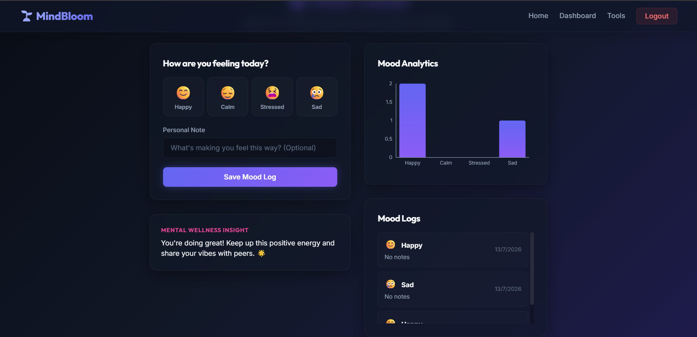
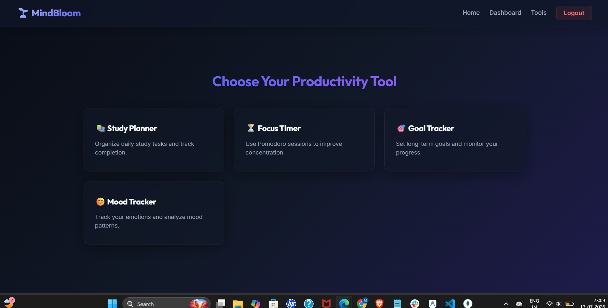

**MindBloom** 🌱
A productivity and mental wellness web app for students to stay focused, track study sessions, and build better habits.

📸 Screenshots
**Dashboard**

**Mood Tracker**

**Tools & Features**



🚀 **Features**

🔐 User Authentication (Register & Login)
⏳ Focus Session Tracking with **Ambient Soundscapes** (Rain, Forest, Cafe, Ocean) and **Study Task Association**
🧘 **Mindful Wellness Corner** (Interactive 4-7-8 Breathing Guide & Daily Affirmations)
🎯 Goal Management
😊 Mood Tracking with emoji selector and **Personalized Mental Health Insights**
🔥 Study Streak System
🏆 Achievement Badges
📊 **Visual Analytics Dashboard** (Productivity charts powered by Recharts)

🛠️** Tech Stack**
Frontend: React, Vanilla CSS, Axios, React Router, Recharts, Framer Motion
Backend: Node.js, Express.js, MongoDB, Mongoose, JWT Authentication, Bcryptjs

**Project Structure**
mindbloom
│
├── backend
│   ├── middleware
│   ├── models
│   ├── routes
│   ├── utils
│   └── server.js
│
└── frontend
    ├── src
    │   ├── components
    │   ├── pages
    │   └── App.js

⚙️ **Installation**
  1. Clone the repository:
     ```bash
     git clone https://github.com/yourusername/mindbloom.git
     cd mindbloom
     ```
  2. Install backend dependencies:
     ```bash
     cd backend
     npm install
     ```
  3. Install frontend dependencies:
     ```bash
     cd ../frontend
     npm install
     ```
   
▶️ **Running the Project**

Start backend:
```bash
cd backend
npm start
```

Start frontend:
```bash
cd frontend
npm start
```

Frontend: http://localhost:3000 (or http://localhost:3001 if port 3000 is occupied)
Backend: http://localhost:5000

🔑 **Environment Variables**
Create a `.env` file in your `backend` folder:
```env
MONGO_URI=your_mongodb_connection
JWT_SECRET=your_secret_key
```

